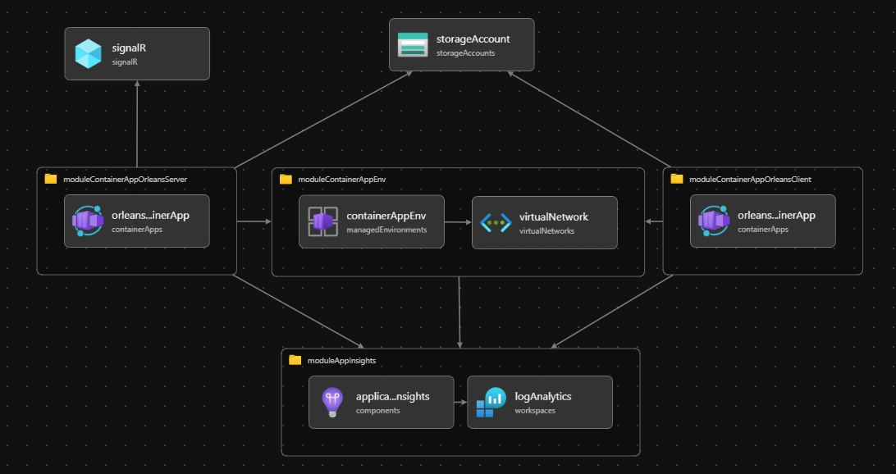

# Playing with device offline detection using Orleans

- The idea for this concept came from [Device Offline detection with Durable Entities](https://dev.to/azure/device-offline-detection-with-durable-entities-e8g) by Kees Schollaart
- I wanted to experiment with it and learn from the process
- I have another solution using Azure Functions with Durable Entities, which can be [found here](https://github.com/19balazs86/PlayingWithDeviceOfflineDetection)

## In this repository/solution

I have adopted the version of Azure Functions with Durable Entities in the style of the actor model using Orleans. The concept is simple, but incorporates the following features working together:

- **SignalR** with Backplane, using Redis for local development and Azure SignalR in Azure cloud
- **Orleans**:
  - Both server (Silo cluster) and client have multiple replicas
  - Azure Table Storage for clustering, grain storage, grain directory, and reminders
  - Dashboard
- Distributed tracing with **OpenTelemetry**
- **.NET Aspire** bringing everything together, making it a pleasure to work with
- Deploy to Azure Container Apps
  - Container Apps support Dapr, and the same concept applies to the Dapr Actor framework
  - While Orleans requires a custom virtual network when creating a Container Environment, the Dapr Actor framework can work with the default environment

## Running it locally

- Docker Desktop is required to run the application
- URLs:
  - Device Dashboard (with SignalR): https://localhost:7211/dashboard
  - Send heartbeat (random devices) with the client: https://localhost:7251/send-heartbeat
  - Orleans Dashboard: [http://localhost:8585](http://localhost:8585)

## Resources

#### .NET Aspire

- [Documentation](https://learn.microsoft.com/en-us/dotnet/aspire/get-started/aspire-overview) 📚*MS-Learn*
  - [Integrations](https://learn.microsoft.com/en-us/dotnet/aspire/fundamentals/integrations-overview)
  - [Orleans with .NET Aspire](https://learn.microsoft.com/en-us/dotnet/aspire/frameworks/orleans)
- [Samples](https://github.com/dotnet/aspire-samples) | [Aspire / playground samples](https://github.com/dotnet/aspire/tree/main/playground) 👤*dotnet*

#### Orleans

- [Documentation](https://learn.microsoft.com/en-us/dotnet/orleans/overview) 📚*MS-Learn*
  - [Best practices](https://learn.microsoft.com/en-us/dotnet/orleans/resources/best-practices)
  - [NuGet packages](https://learn.microsoft.com/en-us/dotnet/orleans/resources/nuget-packages)
- [Playing with Microsoft Orleans](https://github.com/19balazs86/PlayingWithOrleans) 👤

## Infrastructure provisioning with a Bicep template

- You can find a [main.bicep](bicep-script/main.bicep) template file that contains all the related objects for provisioning the infrastructure of Azure Container Apps
- Improvement: Instead of using the connection string of SignalR and Storage-Account, would be better to create a User Assigned Identity and use RBAC. But for simplicity the connection string suffice.
- Note: The Orleans Dashboard is working fine on port 8585, but it runs on HTTP, not HTTPS.

